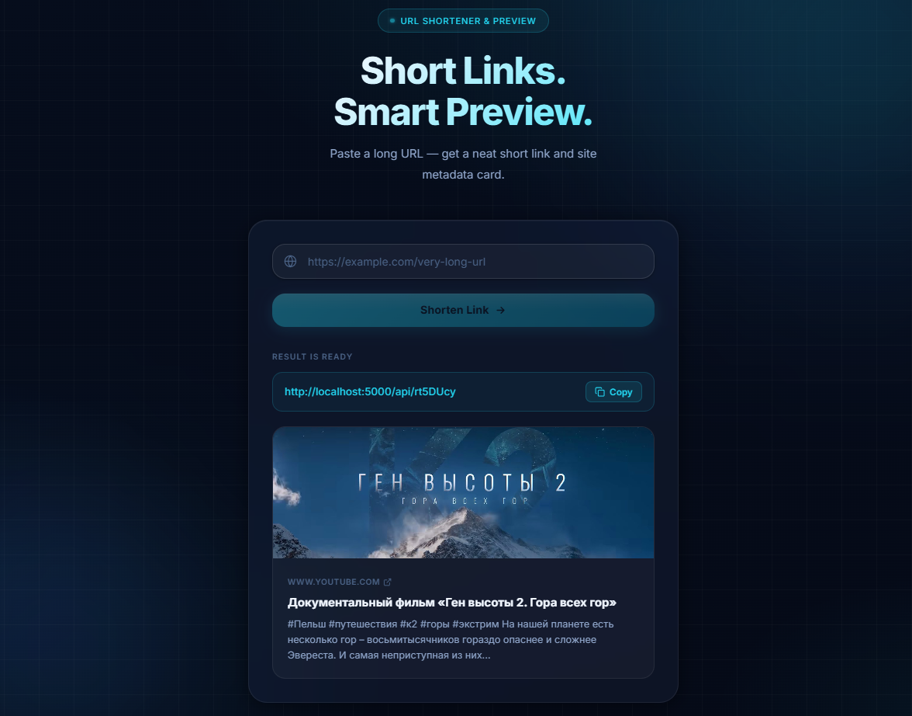

# URL Snap & Preview

A link shortening service with automatic metadata extraction (Open Graph) to create interactive preview cards.



### 🎬 Live Demo / Preview

You can watch the service in action here:
[Watch Preview](https://drive.google.com/file/d/1LDxFPWJ7eKr5AFz9cfDJ_-HiKEuxW7Tf/view?usp=sharing)

_Note: Please wait for the preview to load or download the `.gif` file to view it locally._

[](https://react.dev/)
[](https://nodejs.org/)
[](https://sequelize.org/)
[](https://www.postgresql.org/)

---

## ✨ Features

- **Instant Shortening**: Generation of unique short identifiers using `nanoid`.
- **Smart Metadata Scraper**: Automatic parsing of Open Graph tags (Title, Description, Image) when a link is inserted.
- **Premium UI**: Modern Glassmorphism design with smooth animations and micro-interactions.
- **Interactive Notifications**: Visual confirmation of link copying (transformation into a checkmark).
- **Validation**: Robust URL validation on both client and server sides.
- **Redirects**: Efficient redirection mechanism via API.

---

## 🔄 User Workflow

1.  **Input**: Paste a long URL into the input field.
2.  **Processing**: The system validates the link and fetches metadata (Title, Description, Image). Note: Scrapers have
    an **8-second timeout** to maintain responsiveness.
3.  **Preview**: An interactive card appears with the site's preview and your new shortened link.
4.  **Copy & Navigate**: Click the short link to copy it (the icon transforms into a checkmark) or use it to
    **redirect** directly to the original destination.
5.  **Continuous Use**: Entering a new URL will **automatically replace** the previous preview card, keeping the
    interface clean and focused.

---

## 🛠 Tech Stack

### Frontend

- **React 19** (Vite)
- **Vanilla CSS** (CSS Modules)
- **Animations**: CSS Keyframes & Transitions

### Backend

- **Node.js & Express**
- **ORM**: Sequelize
- **DB**: PostgreSQL (pg, pg-hstore)
- **Scraping**: Axios & Cheerio
- **ID Generation**: Nanoid

---

## 📂 Project Structure

```text
├── client/                 # React Frontend
│   ├── src/
│   │   ├── components/     # Components (UrlInput, UrlPreview)
│   │   ├── App.jsx         # Main application logic
│   │   └── App.module.css  # Global styles and tokens
│   └── vite.config.js      # Vite configuration with proxy
│
├── server/                 # Express Backend
│   ├── src/
│   │   ├── controllers/    # Request handling (ShortenController)
│   │   ├── services/       # Business logic and DB interaction (ShortenService)
│   │   ├── routes/         # API endpoints
│   │   └── utils/          # Utilities (Metadata parsing)
│   ├── db/                 # Sequelize models and migrations
│   └── .env                # Environment and DB settings
```

---

## 🛠 Shortcuts (Makefile)

If you have `make` installed, you can use these shortcuts:

- `make install` — Install dependencies for both client and server.
- `make db` — Initialize the database (migrations).
- `make clean` — Remove `node_modules` and build artifacts.

---

## 🚀 Installation and Setup

### 1. Clone the repository

```bash
git clone https://github.com/paultasov/url-shortener-preview.git
cd url-shortener-preview
```

### 2. Backend Setup

Go to the server directory and install dependencies:

```bash
cd server
npm install
```

Create a `.env` file in the `server` folder and configure the database connection using the provided `.env.example` as a
template:

```env
DB_NAME=url-shortener-preview
DB_USERNAME=your_user
DB_PASSWORD=your_password
DB_PORT=5432
DB_HOST=127.0.0.1
SERVER_PORT=5000
```

Initialize the database:

```bash
npm run db
```

Start the development server:

```bash
npm run dev
```

### 3. Frontend Setup

In a new terminal, go to the client folder and install dependencies:

```bash
cd client
npm install
```

Start the client:

```bash
npm run dev
```

The application will be available at: `http://localhost:5173`

---

## 📡 API Endpoints

- `POST /api/shorten` — Accepts `{ "url": "..." }`, returns short link and metadata.
- `GET /api/:shortCode` — Redirects to the original URL.

---

## 🐳 Development

- **Timeout**: Metadata parsing is limited to 8 seconds for optimal UX.
- **Validation**: URL check includes verifying the presence of a domain dot and `new URL()` structure correctness.
- **Proxy**: Vite is configured to proxy `/api` requests to port `5000`.

---

## 📬 Contact

- **Email**: [paultasov@gmail.com](mailto:paultasov@gmail.com)
- **Telegram**: [@pavel_tanasov](https://t.me/pavel_tanasov)

Feel free to contact me with any questions! Paul
